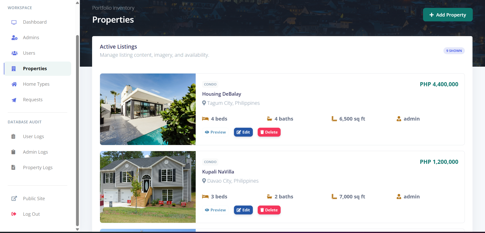
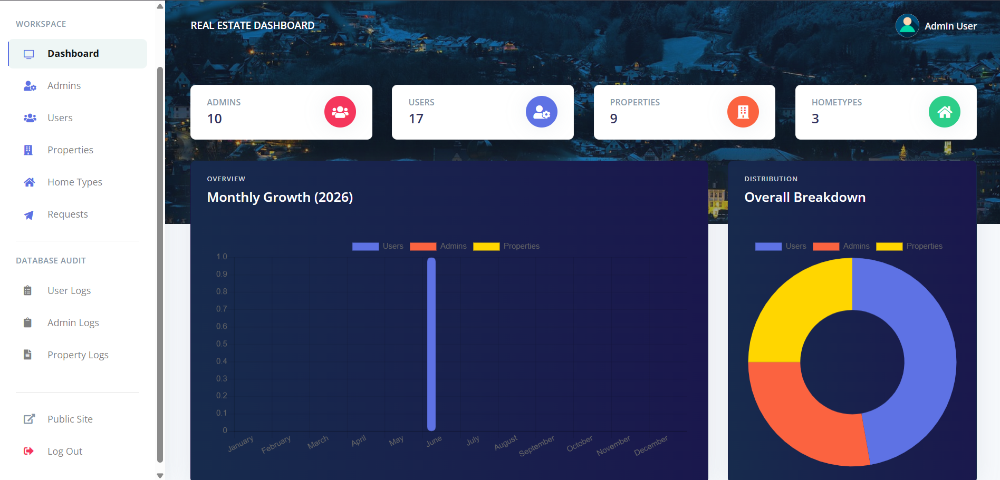
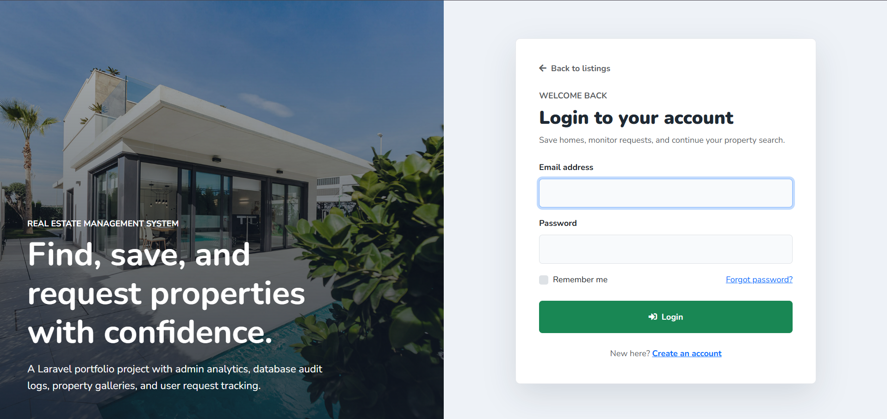
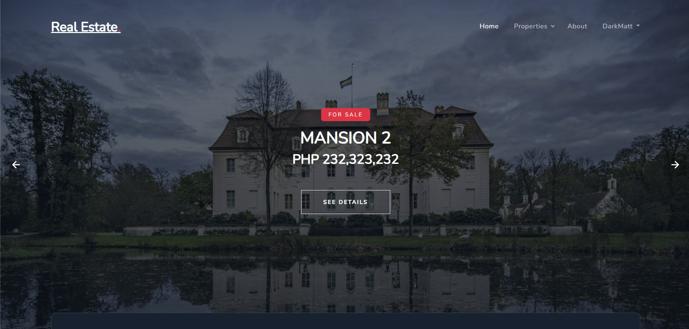
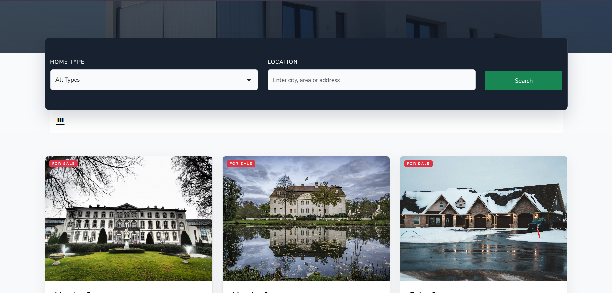

# Real Estate Management System

A Laravel real estate management system built from my Advanced Database college final project and refined as a portfolio-ready web application. It showcases a public property marketplace, user saved/request workflows, and an admin console backed by structured MySQL database features.

## Screenshots

<p align="center">
  
  
</p>

<p align="center">
  
  
</p>

<p align="center">
  
</p>

## Project Highlights

- Public property browsing with search, home type filtering, image galleries, and detail pages.
- Authenticated user area for saved properties and property viewing requests.
- Admin dashboard for managing users, admins, home types, properties, requests, and audit records.
- Database-focused implementation using MySQL views, triggers, stored procedures, indexed tables, and soft deletes.
- Laravel MVC structure with server-rendered Blade views and XAMPP-friendly local setup.

## Advanced Database Features

- `requests_view` joins request, user, and property data for the admin request board.
- `users_view` exposes user management fields without exposing password data.
- Database triggers record admin, user, and property activity into audit log tables.
- Stored procedures support guarded delete workflows for users and admins.
- Soft deletes preserve home type records for review and restoration.

## Tech Stack

- Laravel
- PHP
- MySQL
- Blade
- Bootstrap
- Vite
- XAMPP

## Demo Accounts

- Admin: `admin@realestate.com` / `12345678`
- Additional seeded admins: `manager@realestate.com`, `sysadmin@realestate.com` / `12345678`

Regular users can be created from the register page or through the admin user manager.

## Local Setup

1. Start Apache and MySQL in XAMPP.
2. Create a MySQL database, for example `real_estate`.
3. Copy `.env.example` to `.env` and update the database values:

```env
DB_CONNECTION=mysql
DB_HOST=127.0.0.1
DB_PORT=3306
DB_DATABASE=real_estate
DB_USERNAME=root
DB_PASSWORD=
```

4. Install dependencies and prepare the application:

```bash
composer install
npm install
php artisan key:generate
php artisan migrate:fresh --seed
npm.cmd run build
```

5. Open the app through XAMPP or run:

```bash
php artisan serve
```

## Useful URLs

- Public listings: `/home`
- User login: `/login`
- User register: `/register`
- Admin login: `/admin/login`
- Admin dashboard: `/admin/dashboard`
